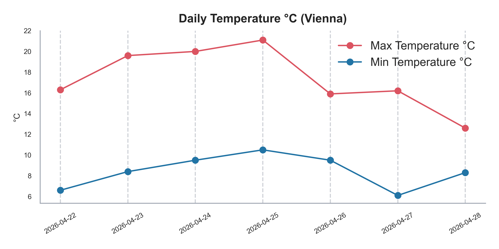
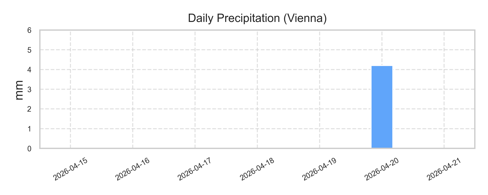
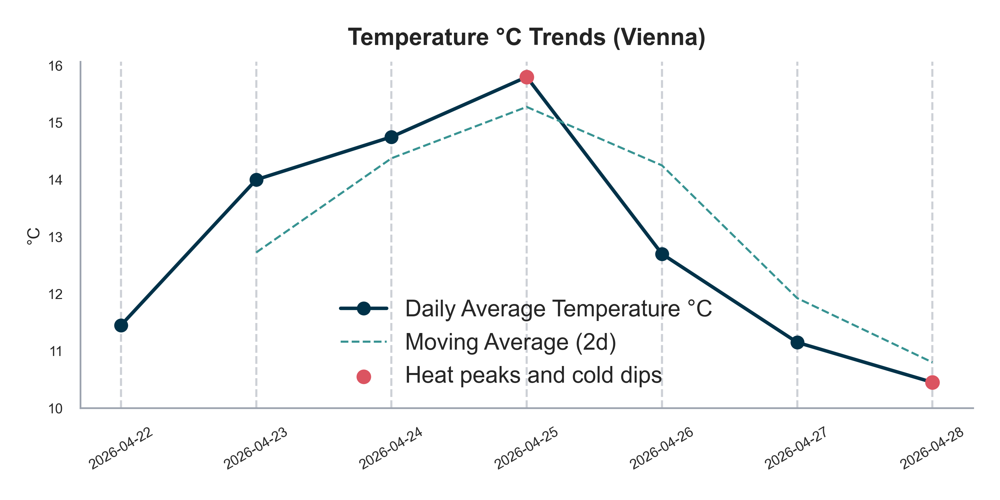

# 🌀🌦️ AtmosPulse (Python)

A modular Python project for analyzing and visualizing real-world weather data using API integration, time-series analysis, and statistical techniques.

This project demonstrates an end-to-end data pipeline:

API → Data Processing → Analysis → Visualization → Insights

---

## ✨ Features

* 🌍 Fetch real-time weather data (Vienna, AT) via API
* 🐼 Structured data handling using Pandas
* 📊 Compute key metrics:

  * Average temperature
  * Moving averages (trend smoothing)
  * Temperature anomalies (heat waves / cold drops)
* 🌧️ Precipitation analysis and visualization
* 📈 Time-series visualizations (temperature trends)
* 🔥 Anomaly detection and highlighting
* 💾 Export analysis results to CSV
* 🧠 Clean, modular project structure

---

## 🧱 Project Structure

```
atmos-pulse/
│
├── src/               # Core logic
│   ├── data_loader.py
│   ├── analysis.py
│   ├── visualization.py
│
├── outputs/           # Generated files (plots, exports)
├── main.py            # Entry point
├── README.md
```

---

## 📸 Example Output





---

## ⚙️ Tech Stack

* Python 3.14
* Pandas
* NumPy
* Matplotlib
* Requests (API integration)

---

## ▶️ How to Run

```bash
pip install -r requirements.txt
python main.py
```

---

## 📊 Example Insights Generated

* Identification of hottest and coldest days
* Smoothed temperature trends using moving averages
* Detection of unusual temperature deviations (anomalies)
* Daily precipitation patterns

---

## 🎯 Purpose

This project demonstrates:

* Working with real-world APIs
* Structuring and analyzing time-series data
* Applying rolling statistics and anomaly detection
* Building modular and scalable data workflows
* Visualizing insights effectively using Python
  
---

## 🔮 Future Improvements

* CLI interface (argparse / Typer)
* Interactive dashboards (Plotly / Streamlit)
* Forecasting models (time-series / ML)

---

## 📜 License

CC0-1.0
